# 1 docker for beginners
# 1.1 runing containers

polecenie:
```
docker images
```
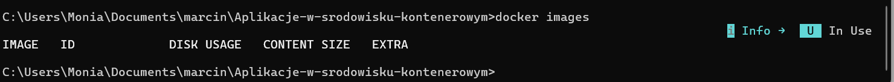

polecenie:
```
docker search ubuntu
```


polecenie:
```
docker pull ubuntu:22.04
```

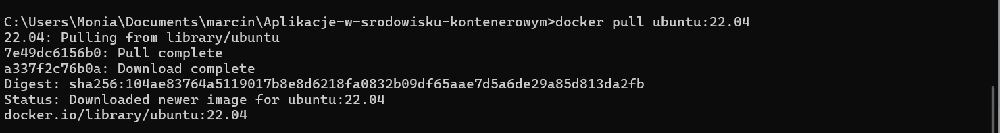

polecenie:
```
docker pull ubuntu:22.10
```


polecenie:
```
docker images
```


polecenie:
```
docker rmi "ID obrazu"
```

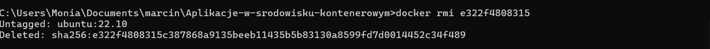

polecenie:
```
docker images
```

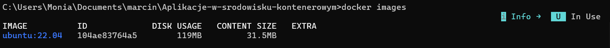

polecenie:
```
docker rmi $(docker images -a -q)
```


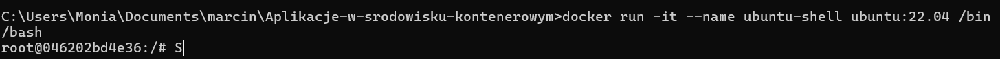

polecenie:
```
$ docker run -it --name ubuntu-shell ubuntu:22.04 /bin/bash

$ docker ps -a
```


polecenie:
```
$ docker start -i ubuntu-shell
```


polecenie:
```
$ docker stop ubuntu-shell
$ docker rm ubuntu-shell
$ docker ps -a
```


# 1.2 Changing images
polecenie:
```
docker pull ubuntu:16.04
```


polecenie:
```
$ docker run -it ubuntu:16.04 /bin/bash

ping
```


polecenie:
```
apt-get update

apt-get install iputils-ping
```


polecenie:
```
docker commit <CONTAINER_ID> youruser/ping:latest

docker images
```

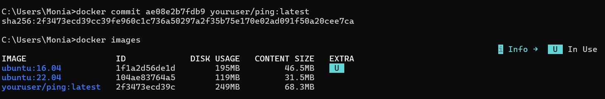

polecenie:
```
$ docker run -it youruser/ping /bin/bash
```

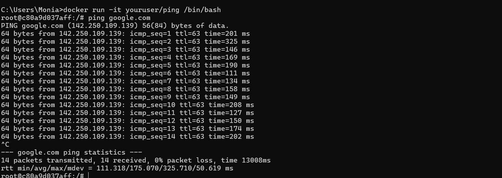

# 1.3 Building images

polecenie:
```
docker pull ubuntu:16.04
```

polecenie/zawartość pliku:
```
$ touch Dockerfile

FROM ubuntu:16.04
LABEL author="Marcin"

RUN apt-get update

RUN apt-get install -y iputils-ping
```


polecenie:
```
docker build -t 'marcin/ping' .
```
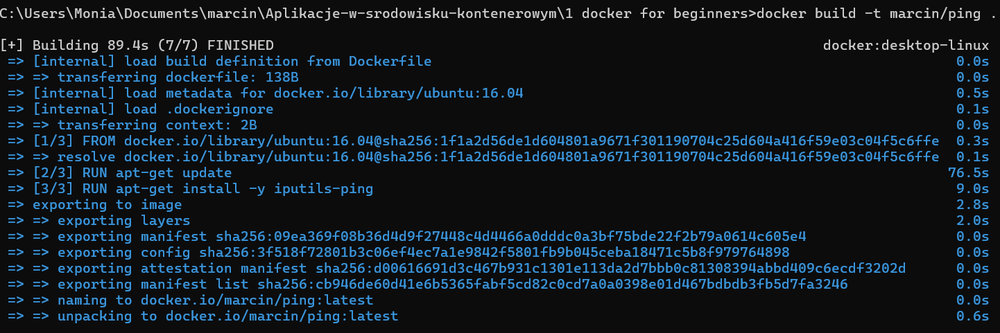

polecenie:
```
docker images
```


polecenie/zawartość pliku:
```
$ touch Dockerfile

FROM ubuntu:16.04
LABEL author="Marcin"

RUN apt-get update \
    && apt-get install -y iputils-ping \
    && apt-get clean \
    && cd /var/lib/apt/lists && rm -fr *Release* *Sources* *Packages* \
    && truncate -s 0 /var/log/*log
```


polecenie:
```
docker images
```


polecenie:
```
docker run -it delner/ping
```


# 1.4 Sharing images

polecenie:
```
docker search kafka
```

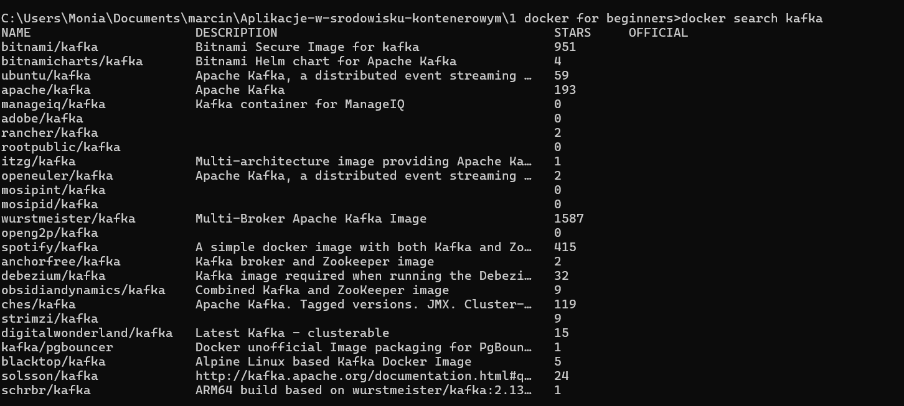

polecenie:
```
docker images

docker tag marcin/ping:latest marcindz2/ping:1.0

docker images

docker rmi marcin/ping:latest

docker images
```


wynik w serwisie

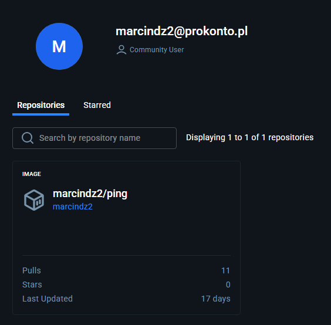

# 1.5 Volumes

polecenie:
```
docker run --rm -d --name apache -p 80:80 httpd:2.4
```

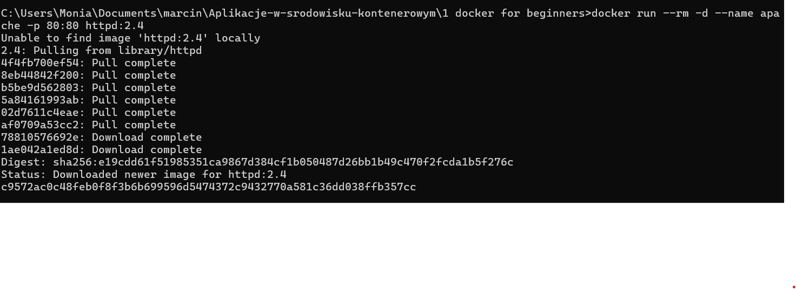

polecenie:
```
curl localhost
```


polecenie:
```
docker cp index.html apache:/usr/local/apache2/htdocs/
```


polecenia:
```
curl localhost

docker volume create myvolume

docker volume ls

docker volume rm myvolume

docker volume ls

docker volume create httpd_htdocs

docker run --rm -d --name apache -p 80:80 -v httpd_htdocs:/usr/local/apache2/htdocs/ httpd:2.4
```

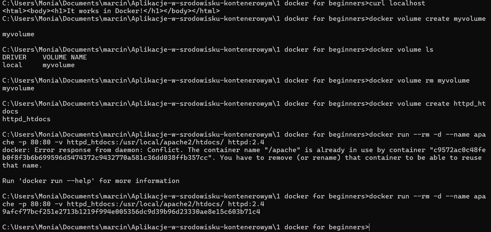


polecenia:
```
docker cp index.html apache:/usr/local/apache2/htdocs/

curl localhost

docker stop apache

docker run --rm -d --name apache -p 80:80 -v httpd_htdocs:/usr/local/apache2/htdocs/ httpd:2.4
c21dd93fea83d710b4d4c954911862760030723df6a5b42650e462e388fe6049

curl localhost
```

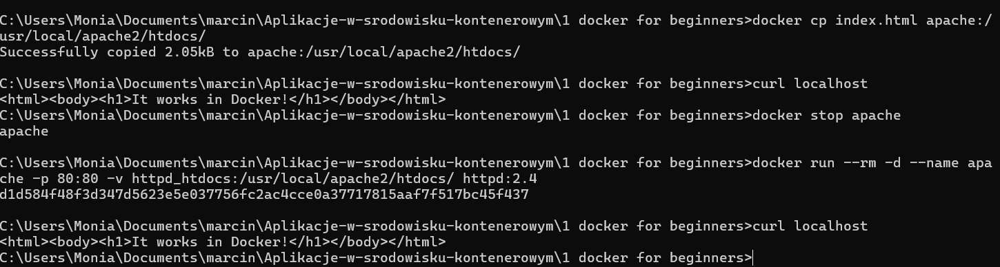

polecenie:
```
docker run --rm -d --name apache -p 80:80 -v "scieżka do pliku" httpd:2.4
0d91516b20ea6113b5dcca08ada6465095dc68663b3d2201dc0490165764f842
curl localhost
curl localhost
```


# 1.6 Networking

polecenie:
```
docker network l

docker network inspect bridge
```


polecenie:
```
docker run --rm -d --name dummy marcindz2/ping:1.0

docker network inspect bridge
```


polecenie:
```
docker run --rm -d -e PING_TARGET=172.17.0.2 --name pinger marcindz2/ping:1.0

docker ps

docker logs pinger
```


polecenie:
```
docker network create skynet

docker run --rm -d --network skynet --name dummy marcindz2/ping:1.0

docker run --rm -d --network skynet -e PING_TARGET=dummy --name pinger marcindz2/ping:1.0

docker logs pinger
```


(dla tego polecenia zmieniłem składnie, ponieważ dostawałem błędy związane z brakiem hasła dla postgresa)
polecenie: 
```
docker run --rm -d --name widgetdb --network skynet -p 5432 -e POSTGRESS_PASSWORD=secret postgres

docker run --rm -d --name gadgetdb --network skynet -p 5432 -e POSTGRESS_PASSWORD=secret postgres

docker ps
```

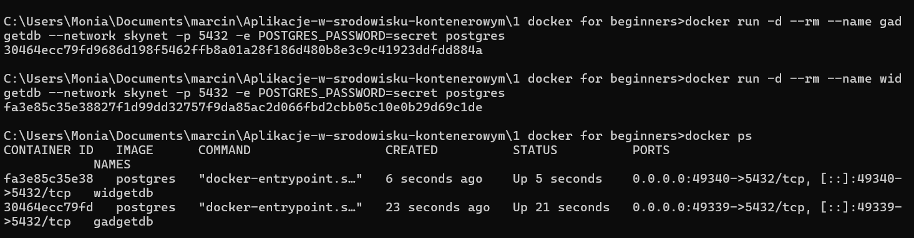

polecenie:
```
docker exec -it widgetdb /bin/bash

psql -U postgres


psql -U postgres -h gadgetdb
```


