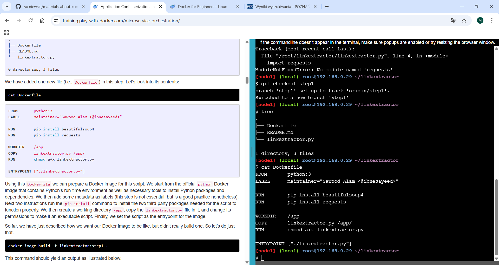
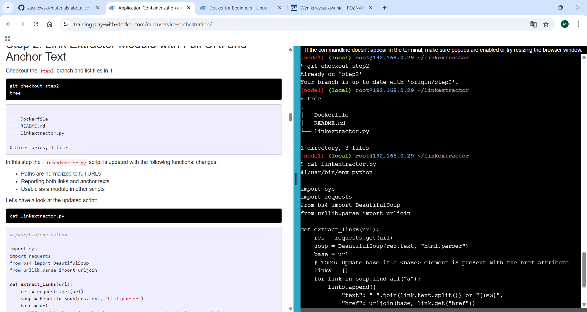
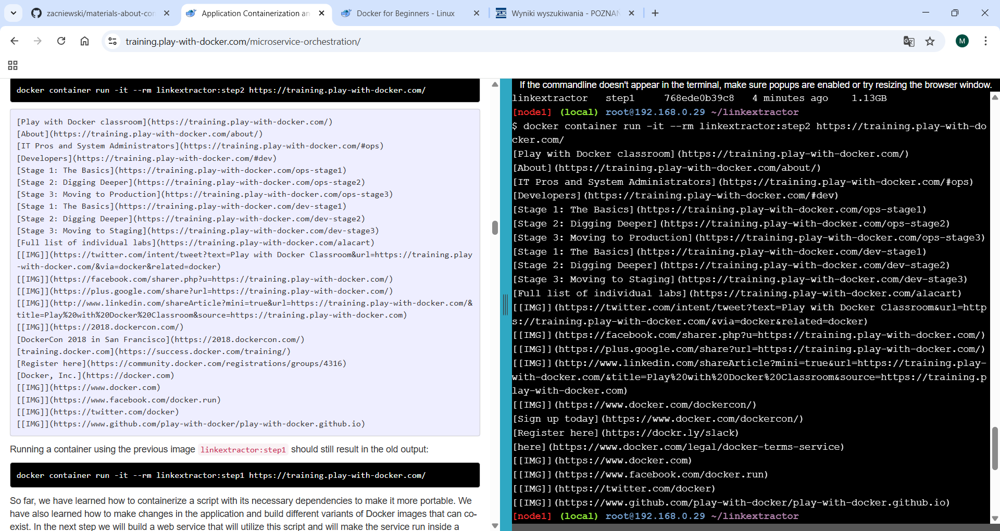
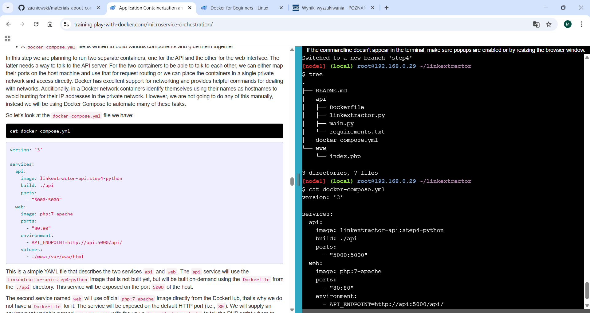
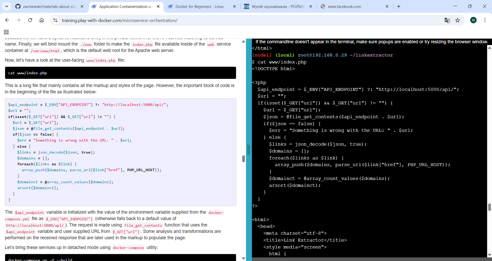
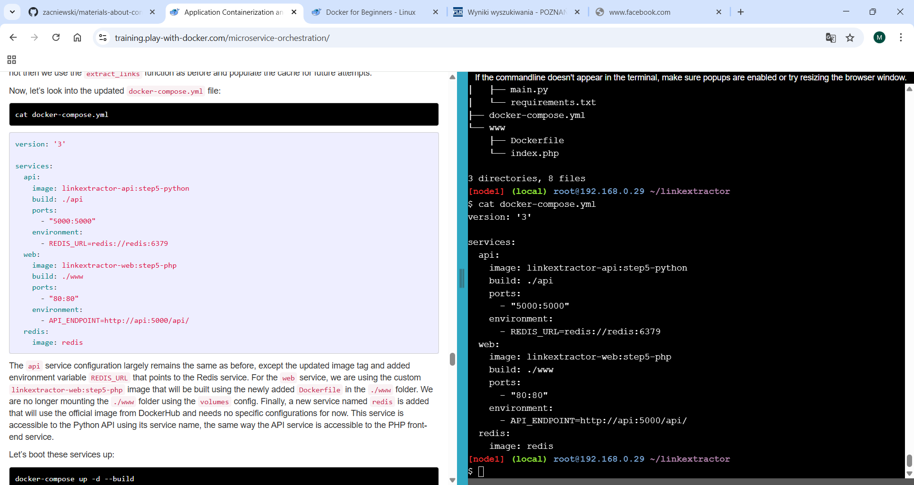
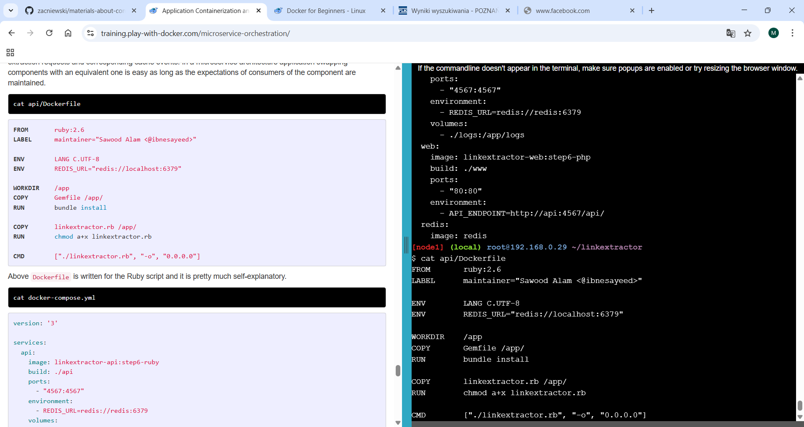
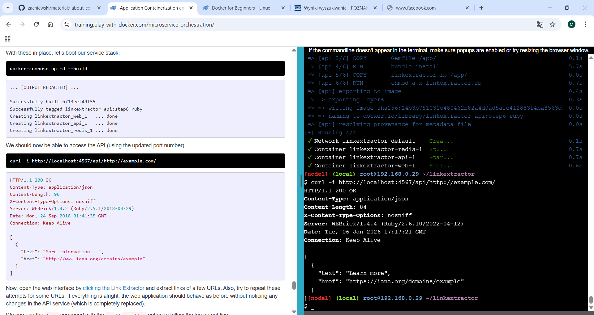
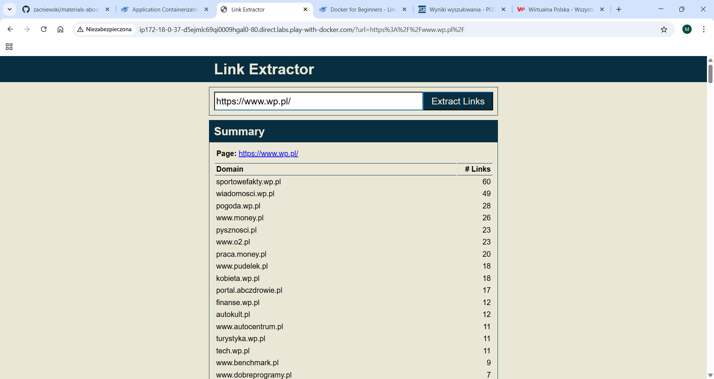

# 2.2 Application Contenerization

# Step 0: Basic Link Extractor Script

Polecenie 
```
git checkout step0
tree

cat linkextractor.py

./linkextractor.py http://example.com/

```


# Step 1: Containerized Link Extractor Script

Polecenie 
```
git checkout step1
tree

cat Dockerfile
```



Polecenie : 
```
docker image build -t linkextractor:step1 .
```


Polecenie : 
```
docker image ls
docker container run -it --rm linkextractor:step1 http://example.com/

docker container run -it --rm linkextractor:step1 https://training.play-with-docker.com/
```


# Step 2: Link Extractor Module with Full URI and Anchor Text


Polecenie :
```
docker image build -t linkextractor:step2 .

docker image ls
```


Polecenie : 
```
docker container run -it --rm linkextractor:step2 https://training.play-with-docker.com/
```




# Step 3: Link Extractor API Service


Polecenie : 
```
docker image build -t linkextractor:step3 .

docker container run -d -p 5000:5000 --name=linkextractor linkextractor:step3

docker container ls
```


Polecenie : 
```
curl -i http://localhost:5000/api/http://example.com/

docker container logs linkextractor
```


# Step 4: Link Extractor API and Web Front End Services


Polecenie : 
```
cat docker-compose.yml
```



Polecenie : 
```
cat www/index.php
```



Polecenie : 
```
docker composte ip -d --build 

docker container ls
```


Polecenie :
```
curl -i http://localhost:5000/api/http://example.com/

sed -i 's/Link Extractor/Super Link Extractor/g' www/index.php

git reset --hard

docker-compose down 
```


# Step 5: Redis Service for Caching

Polecenie : 
```
cat docker-compose.yml
```



Polecenie :
```
docker composte ip -d --build 

docker-compose exec redis redis-cli monitor

sed -i 's/Link Extractor/Super Link Extractor/g' www/index.php

git reset --hard

docker-compose down 
```


# Step 6: Swap Python API Service with Ruby

Polecenie : 
```
cat api/dockerfile
```



Polecenie :
```
docker composte ip -d --build 

curl -i http://localhost:4567/api/http://example.com/
```



# Używanie Link Extractora na stronie


