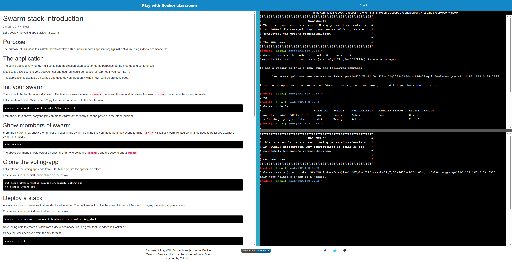
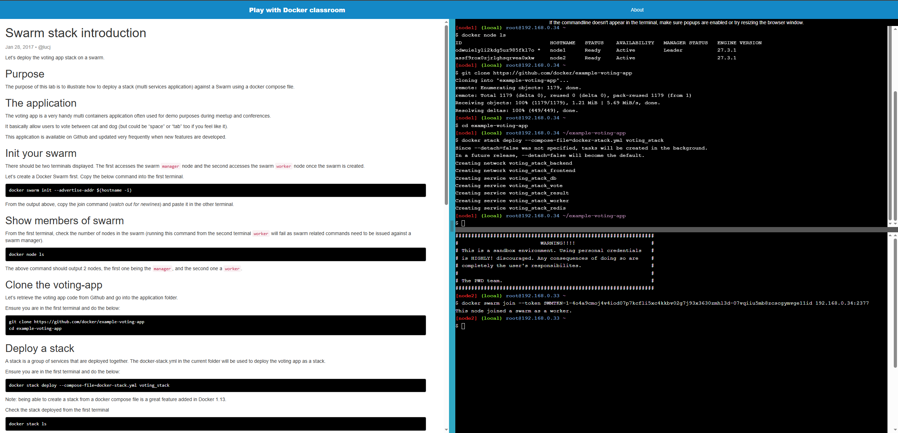
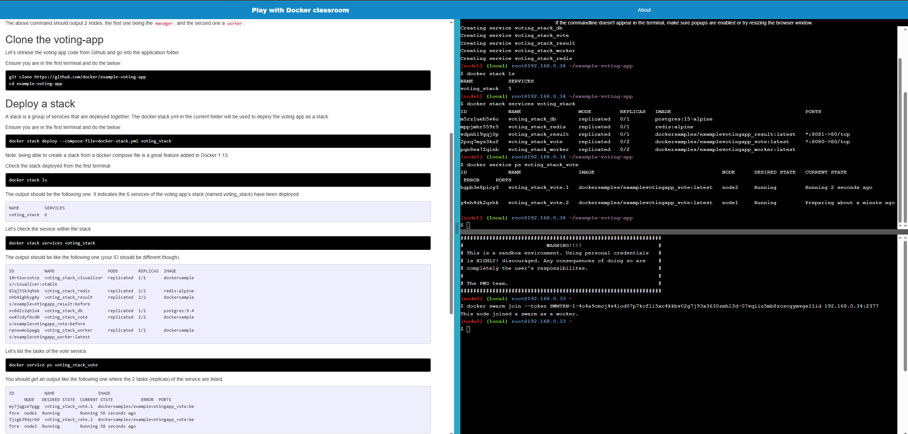
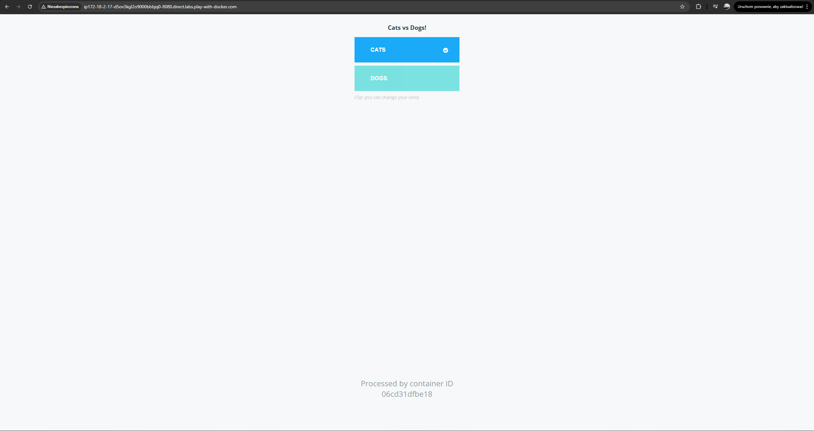

# 2.3

Polecenie 
```
docker swarm init --advertise-addr $(hostname -i)

docker node ls

*Polecenie podane przy inicjalizacji*
```



Polecenie 
```
git clone https://github.com/docker/example-voting-app
cd example-voting-app

docker stack deploy --compose-file=docker-stack.yml voting_stack
```




Polecenie 
```
docker stack ls

docker stack services voting_stack

docker service ps voting_stack_vote
```



Podgląd na stronę

