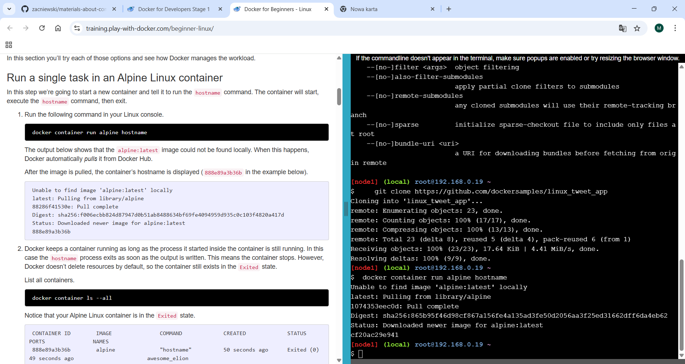
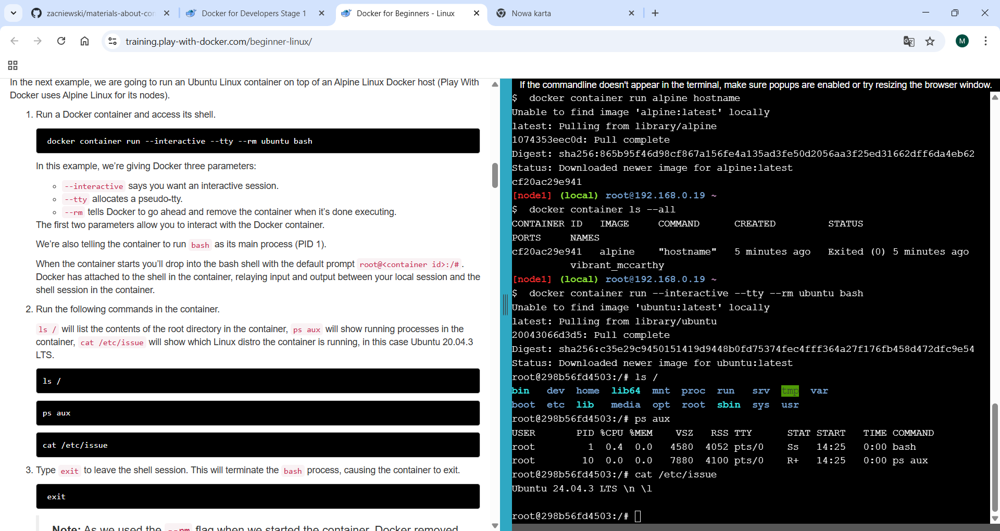
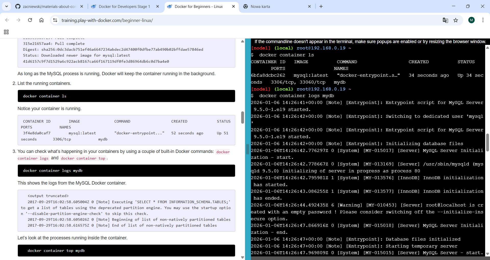
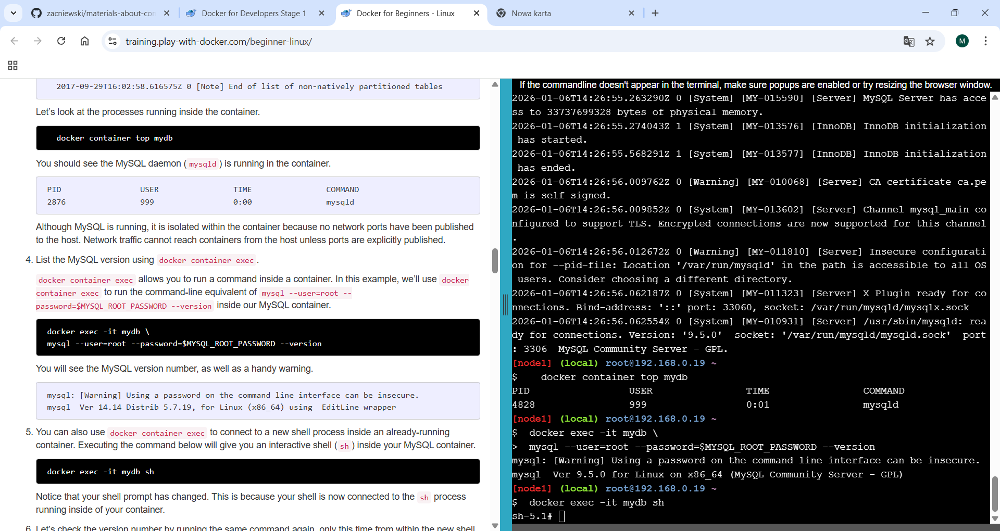
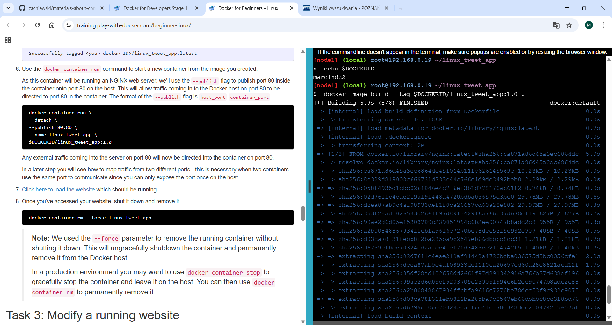
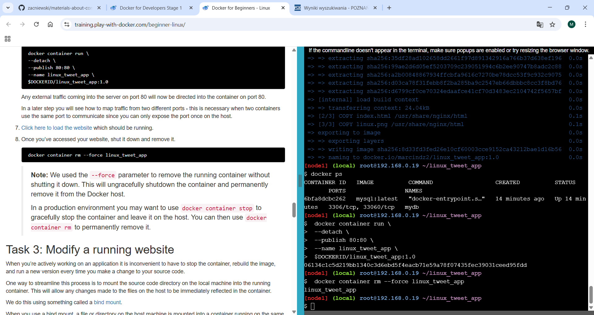
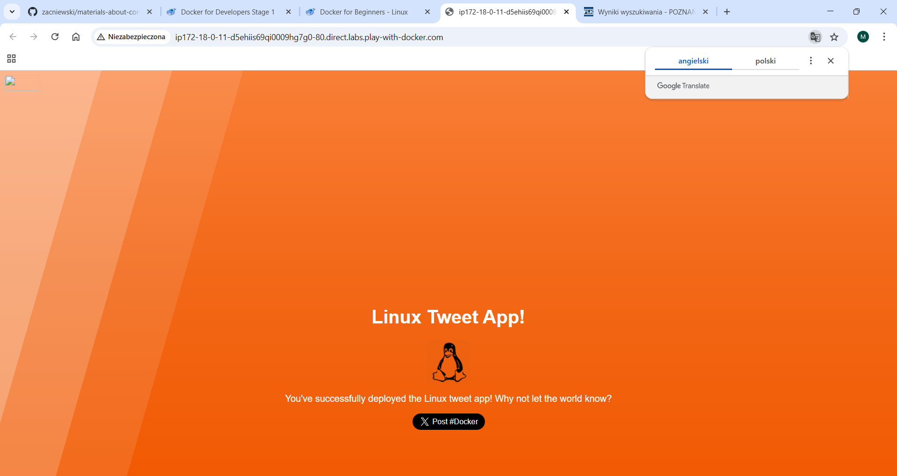
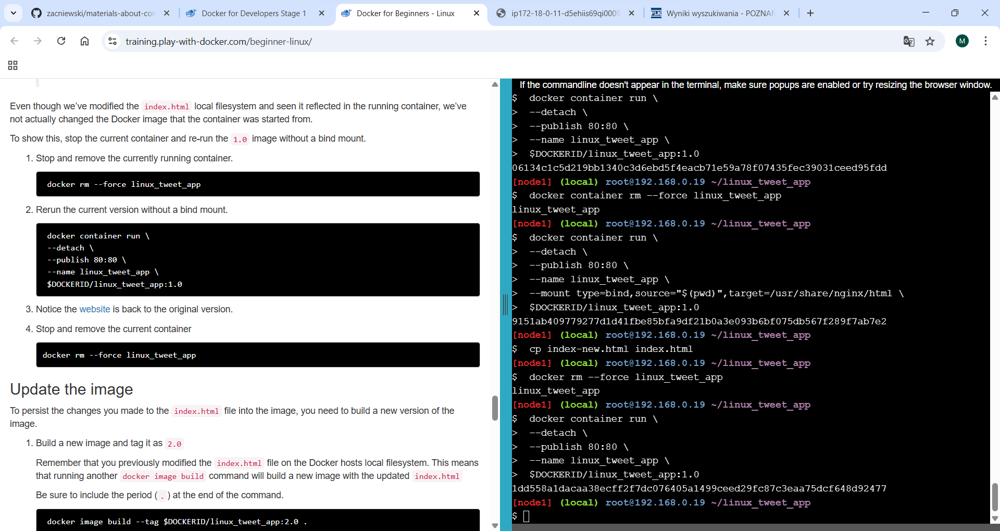
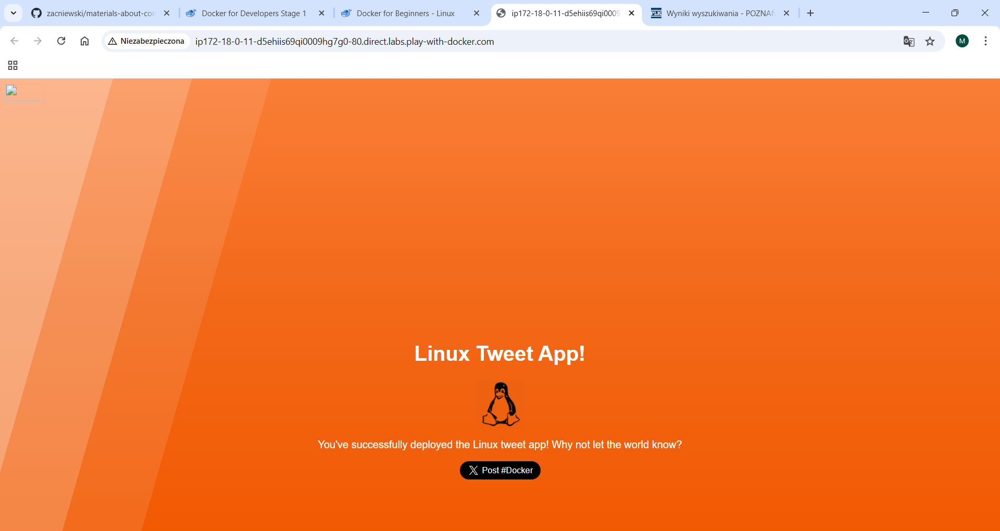
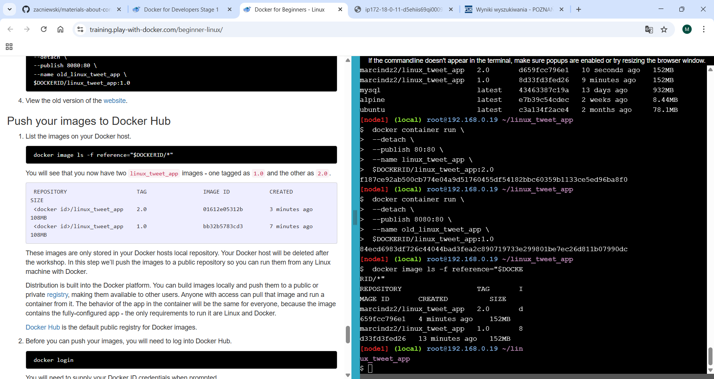

# 2.1 Docker for Beginners - Linux


# Step 0: Prerequisites

Polecenie 
```
git clone https://github.com/dockersamples/linux_tweet_app

```


# Step 1: Run some simple Docker containers

Polecenie 
```
docker container run alpine hostname
```



Polecenie 
```
docker container run --interactive --tty --rm ubuntu bash

ls/

ps aux

cat /etc/issue
```



Polecenie 
```
docker container run \
--detach \
--name mydb \
-e MYSQL_ROOT_PASSWORD=my-secret-pw \
mysql:latest
```


Polecenie 
```
docker container ls

docker container logs mydb
```



Polecenie 
```
docker container top mydb

docker exec -it mydb \

mysql --user=root --password=#MYSQL_ROOT_PASSWORD --VERSION

docker exec -it mydb sh
```



# Step 2: Package and run a custom app using Docker

Polecenie 
```
cat Dockerfile

echo $DOCKERID
```


Polecenie 
```
docker image build --tag $DOCKERID/linux_tweet_app:1.0 .
```


Widok na pierwotną stronę


Polecenie 
```
docker container run \
--detach \
--publish 80:80 \
--name linux_tweet_app \
$DOCKERID/linux_tweet_app:1.0

docker container rm--force linux_tweet_app
```



# Step 3: Modify a running website

Polecenie 
```
docker container run \
--detach \
--publish 80:80 \
--name linux_tweet_app \
--mount type=bind,source="$(pwd)",target=/usr/share/nginx/html \
$DOCKERID/linux_tweet_app:1.0
```


Widok na zmodyfikowana stronę



Polecenie 
```
cp index-new.html index.html

docker rm --force linux_tweet_app

docker container run \
--detach \
--publish 80:80 \
--name linux_tweet_app \
$DOCKERID/linux_tweet_app:1.0
```



Nastąpił powrót do poprzedniej strony


Polecenie 
```
docker rm --force linux_tweet_app

docker image build --tag $DOCKERID/linux_tweet_app:2.0 .

docker image ls
```


Nowa wersja strony 



Porównanie obu stron na raz w róznych przeglądarkach w tym samym czasie


Polecenie:
```
docker image ls -f reference="$DOCKERID/*"

```

