# 3 devops with docker part 1
# 3.1 Definicje i podstawowe pojęcia

Polecenie:
```

```

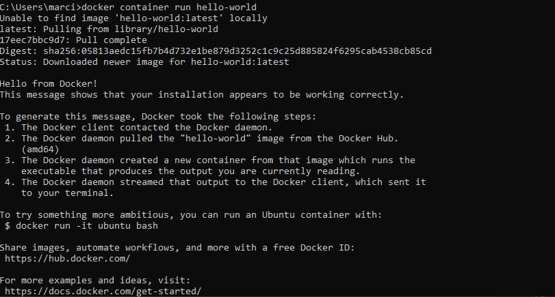


Polecenie:
```
docker container run hello-world
```


Polecenie:
```
docker container run -it ubuntu sh -c 'apt update && apt install -y curl && curl https://www.google.com'
```

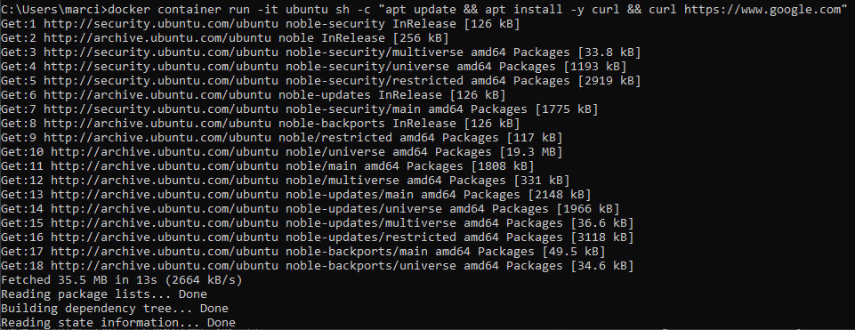

Polecenie:
```
docker container ls -a
```

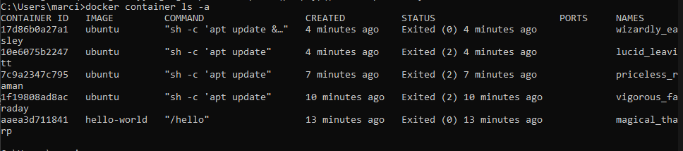

# 3.2 Uruchamianie i zatrzymywanie kontenerów

Polecenie:
```
docker run ubuntu

docker run -it ubuntu
```

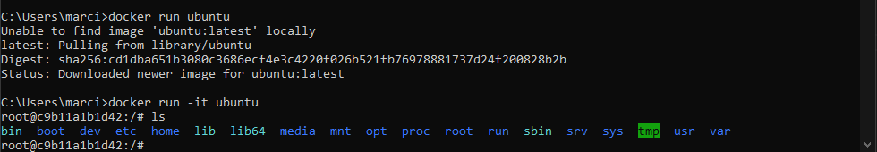


Polecenie:
```
docker run -d -it --name looper ubuntu sh -c "while true; do date; sleep 1; done"
```

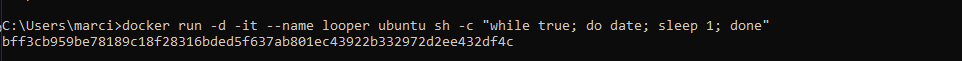

Polecenie:
```
docker logs -f looper
```

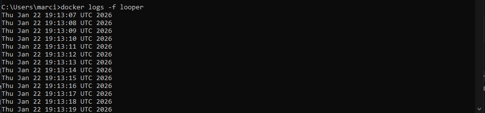

Polecenie:
```
docker attach looper
```

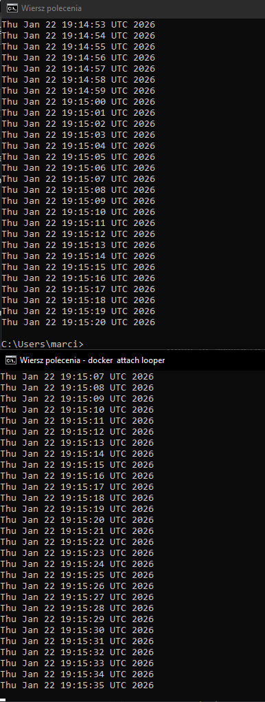


Polecenie:
```
docker attach --no-stdin looper
```

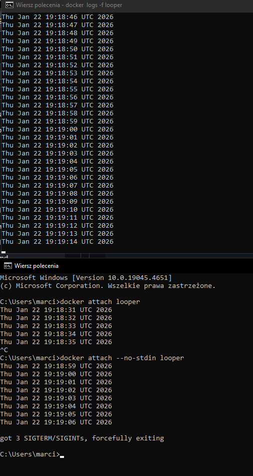

Polecenie:
```
docker exec looper ls -la
```

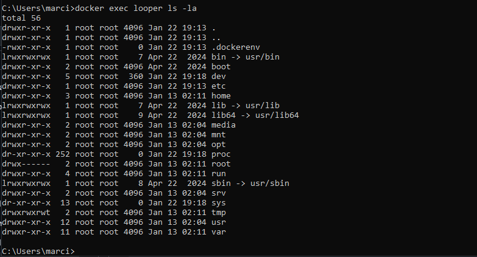

Polecenie:
```
docker exec -it looper bash

docker kill looper

docker rm looper
```

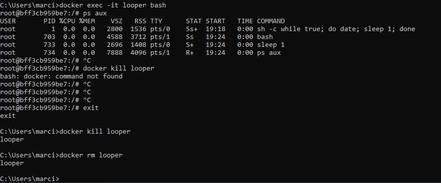

Polecenie:
```
docker run -d --rm -it --name looper-it ubuntu sh -c "while true; do date; sleep 1; done"
docker attach looper-it
```

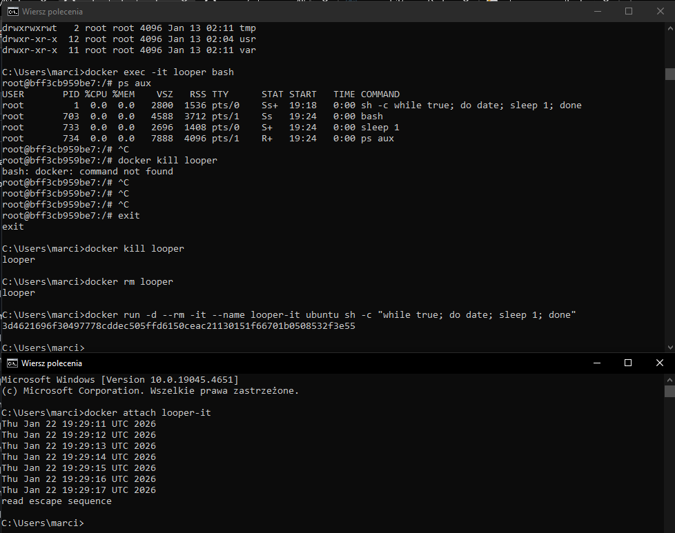

# 3.3 Dogłębne spojrzenie na obrazy

Polecenie:
```
docker search hello-world
```

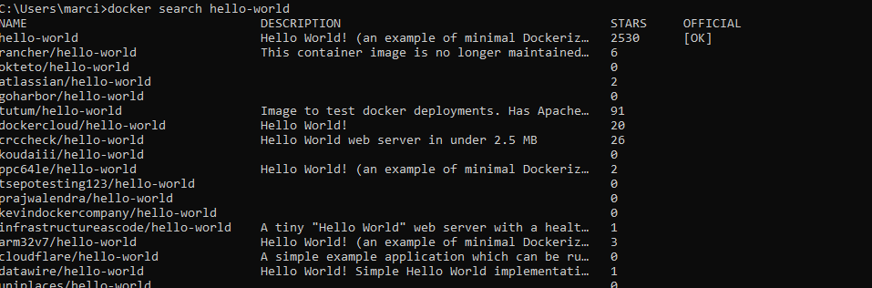

Polecenie:
```
docker pull ubuntu

docker pull ubuntu:22.04

```

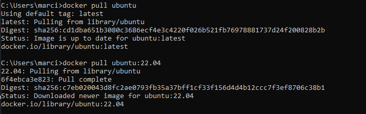


Polecenie:
```
docker build ./section-3 -t sekcja3

```

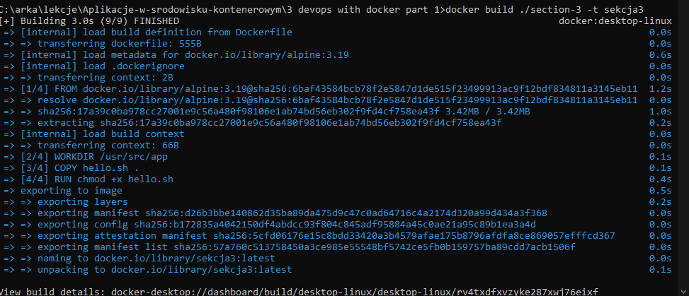


Polecenie:
```
docker image ls

docker run sekcja3

```

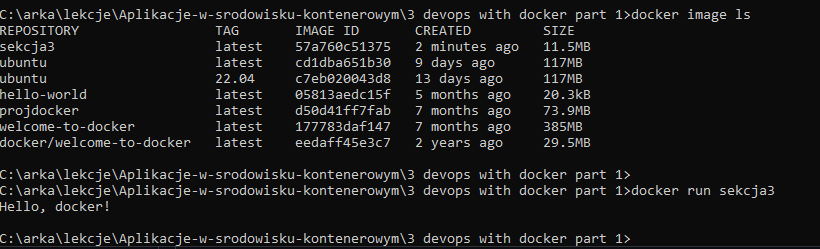

Polecenie:
```
docker run -it sekcja3 sh

docker ps

notepad additional.txt

docker cp ./additional.txt crazy_mccarthy:/usr/src/app/

docker diff crazy_mccarthy

```

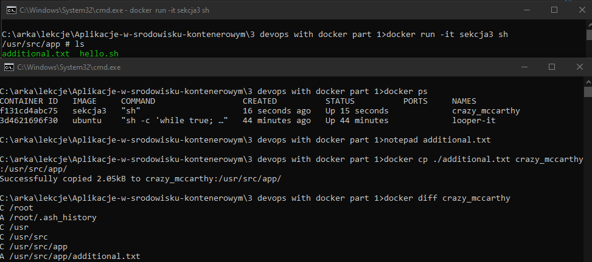


Polecenie:
```
docker commit crazy_mccarthy sekcja3-additional

docker image ls

```

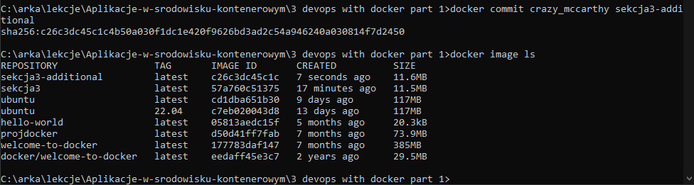


Polecenie:
```
docker build . -t sekcja3:v2

docker run sekcja3:v2 ls

docker run sekcja3-additional ls

```

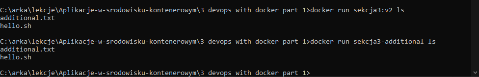

# 3.4 Definiowanie warunków startowych kontenera

Polecenie:
```
docker run -it ubuntu:22.04

apt-get update && apt-get install -y curl

curl -L https://github.com/yt-dlp/yt-dlp/releases/latest/download/yt-dlp -o /usr/local/bin/yt-dlp


```

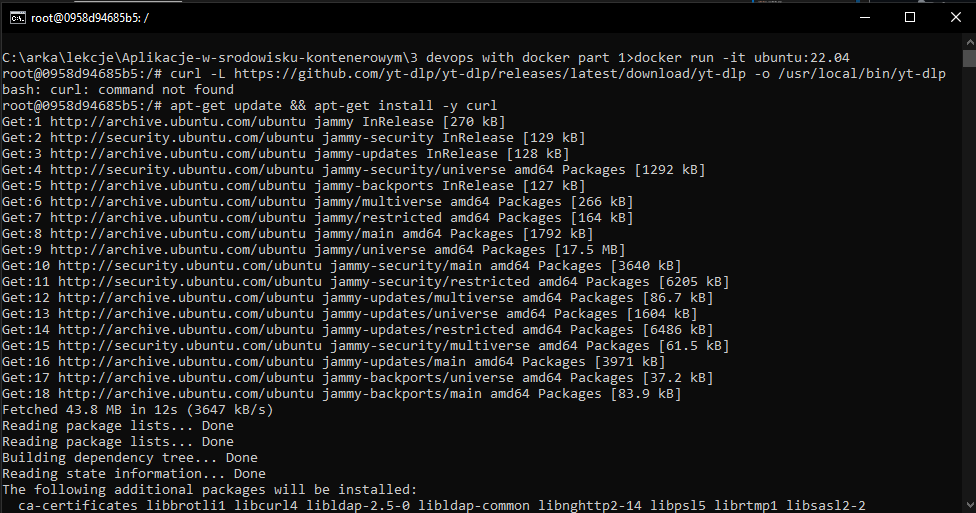

Polecenie:
```
chmod a+rx /usr/local/bin/yt-dlp

apt-get install -y python3
```

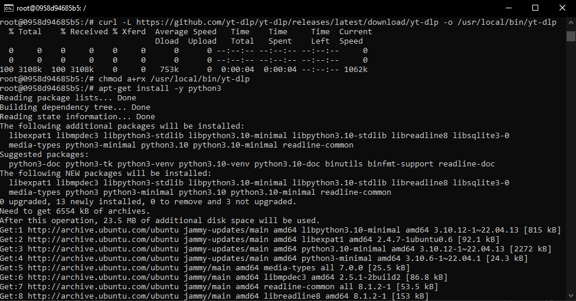


Polecenie:
```
docker build -t yt-dlp ./section-4

docker run yt-dlp

```

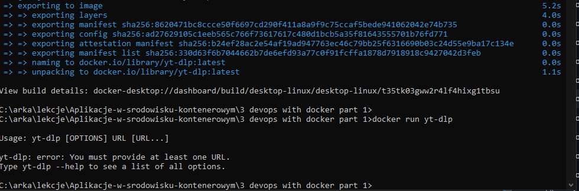

plik docker
```
FROM ubuntu:22.04

WORKDIR /mydir

RUN apt-get update && apt-get install -y curl python3
RUN curl -L https://github.com/yt-dlp/yt-dlp/releases/latest/download/yt-dlp -o /usr/local/bin/yt-dlp
RUN chmod a+x /usr/local/bin/yt-dlp

# Replacing CMD with ENTRYPOINT
ENTRYPOINT ["/usr/local/bin/yt-dlp"]

```
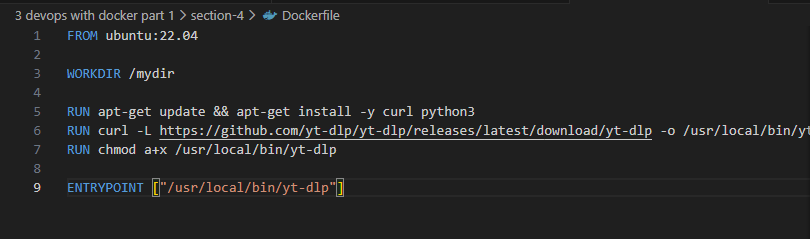


Polecenie:
```
docker build -t yt-dlp ./section-4

docker run yt-dlp https://www.youtube.com/watch?v=dQw4w9WgXcQ

```
W tym przypadku pobieranie sie nie udało, mimo iż filmik na yt został znaleziony poprawnie (co oznacza ze problem leżał po stronie samego yt-dlp a nie dockera)
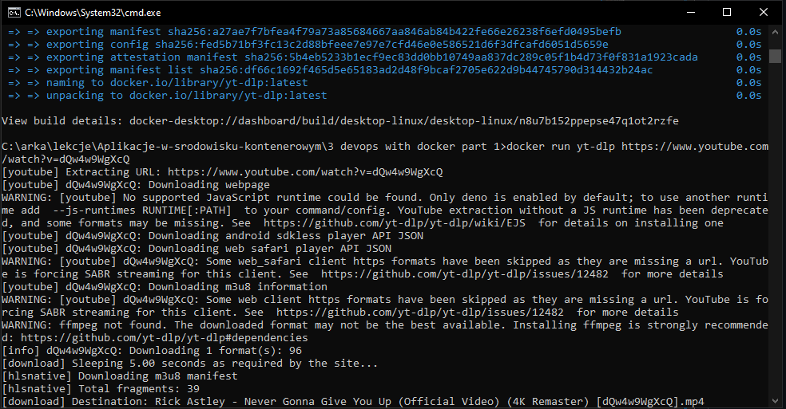

Polecenie:
```
docker pull python:3.11

docker run -it python:3.11

docker run -it python:3.11 --version

docker run -it python:3.11 bash
```

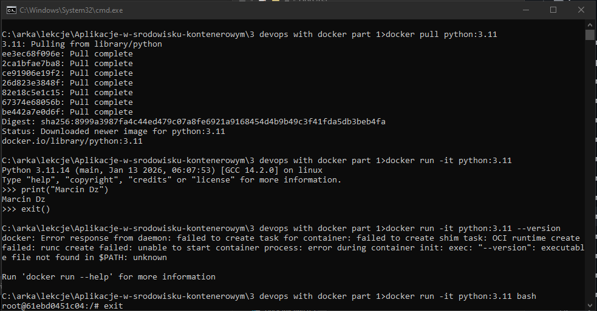

Polecenie:
```
docker diff recursing_murdock
```

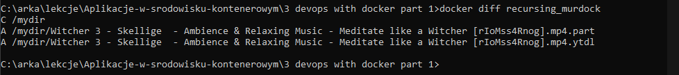

# 3.5 Interakcja z kontenerem przez wolumeny i porty


Polecenie:
```
docker run -v "%cd%:/mydir" yt-dlp https://www.youtube.com/watch?v=DptFY_MszQs
```

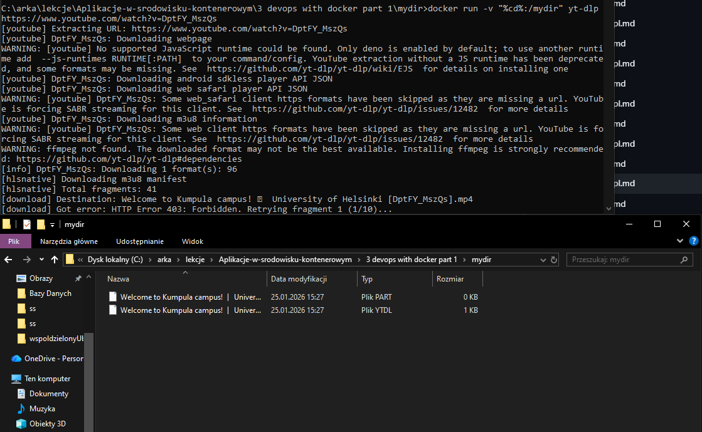

# 3.6 Wykorzystywanie narzędzi z rejestru

Polecenie:
```
docker build . -t rails-project && docker run -p 3000:3000 rails-project
```

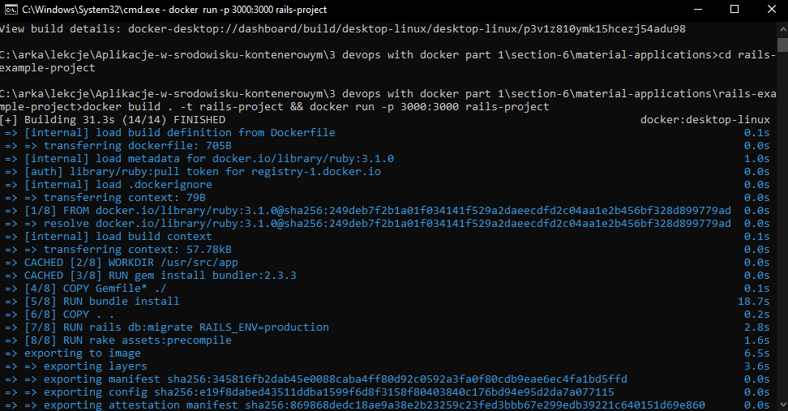

```
docker tag yt-dlp marcindz2/yt-dlp

docker push marcindz2/yt-dlp
```
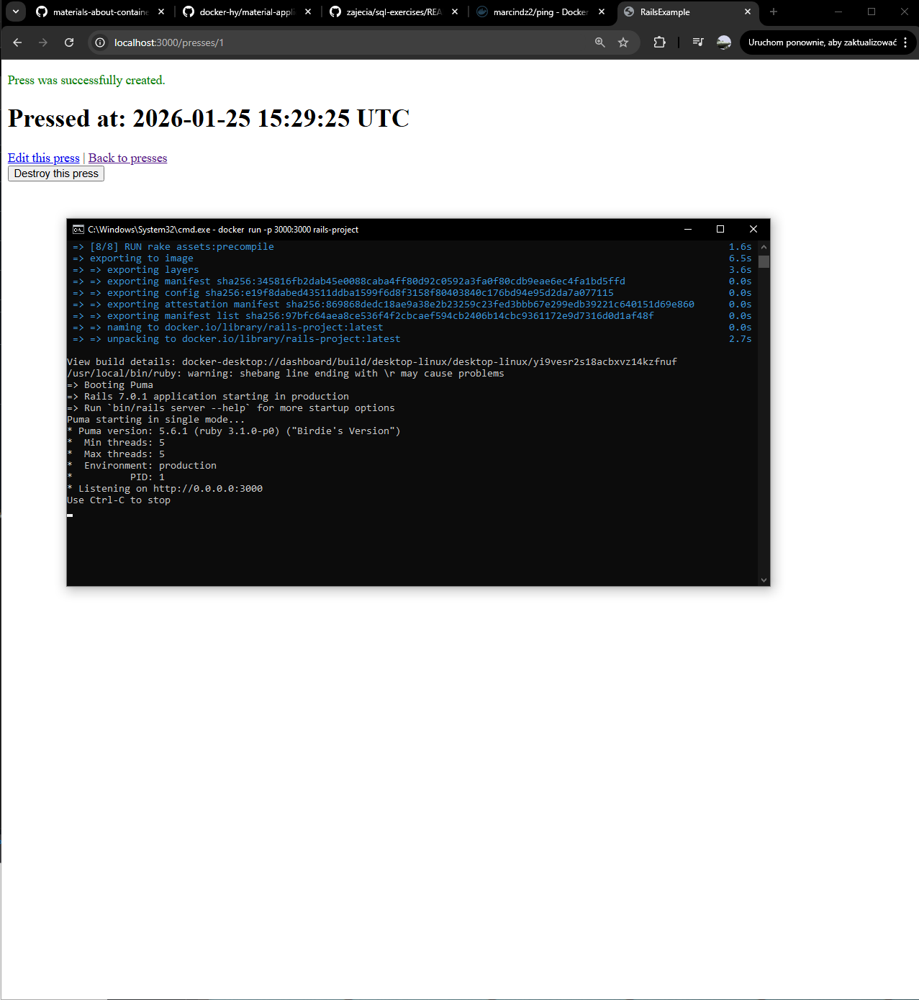