# 4 devops with docker part 2
# 4.1 Migracja do Docker Compose

Polecenie:
```
docker compose build

docker compose push

```

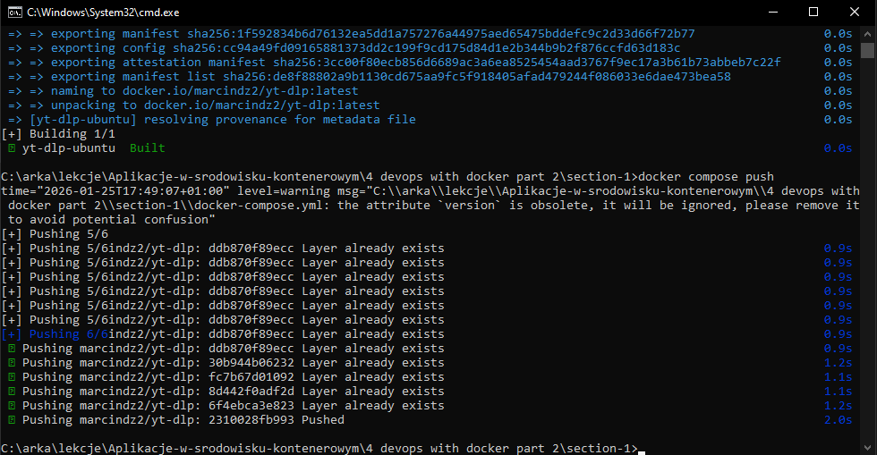

Polecenie:
```
docker compose run yt-dlp-ubuntu https://imgur.com/JY5tHqr

```

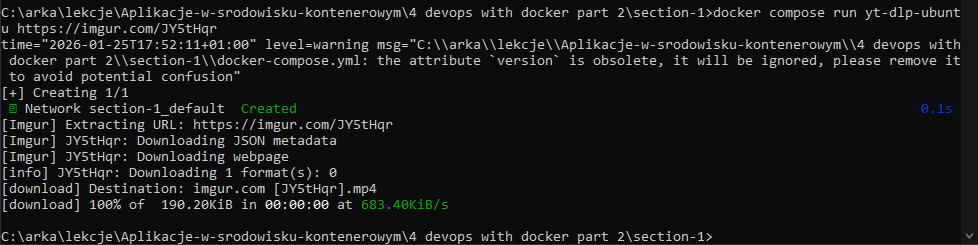

od razu możemy zauważyć, że w tym przypadku mp4 zostało pobrane na nasz komputer

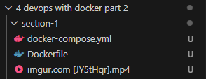


Polecenie:
```

docker container run -d -p 8000:8000 jwilder/whoami

```

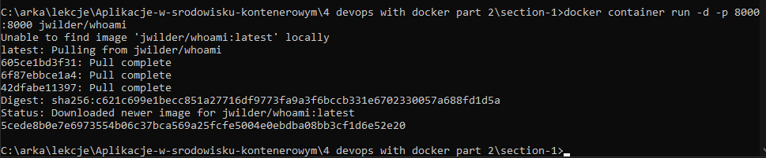

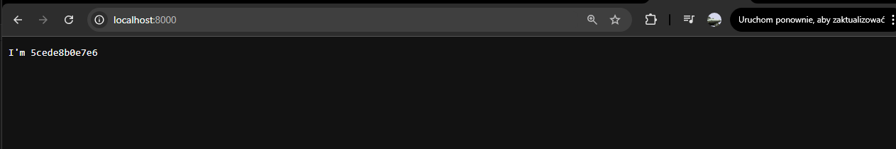

Polecenie:
```

docker compose up -d

```


# 4.2 Sieci Dockera

Polecenie:
```

docker compose up -d --scale whoami=3

```

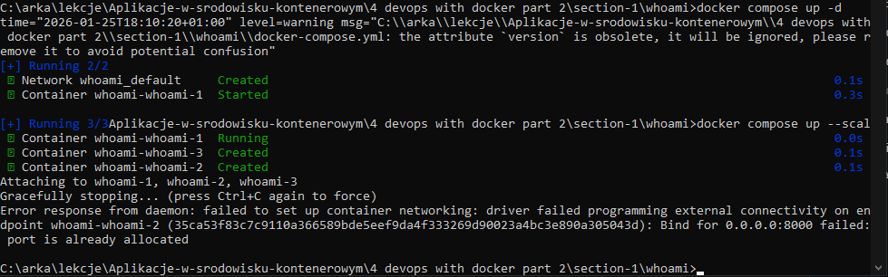

Polecenie:
```

docker compose up --scale whoami=3

docker compose port --index 1 whoami 8000

docker compose port --index 2 whoami 8000

docker compose port --index 3 whoami 8000

```

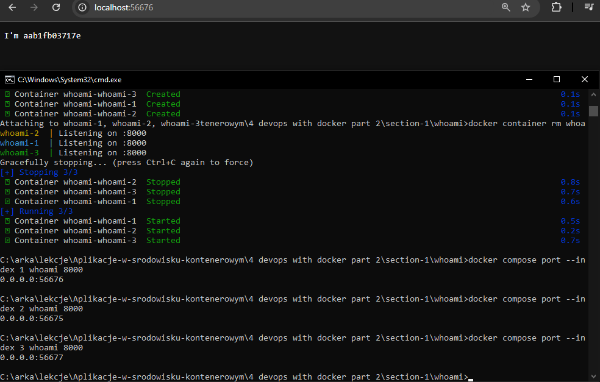

Polecenie:
```

docker compose up -d --scale whoami=3

```

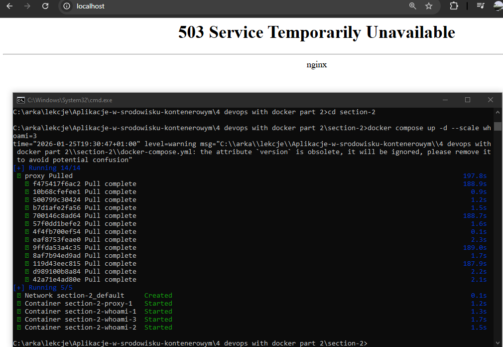

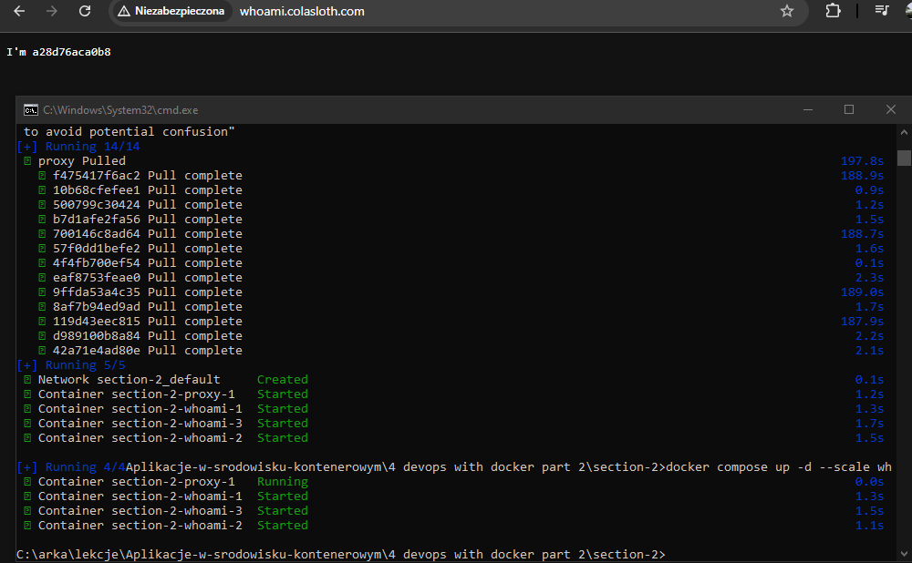

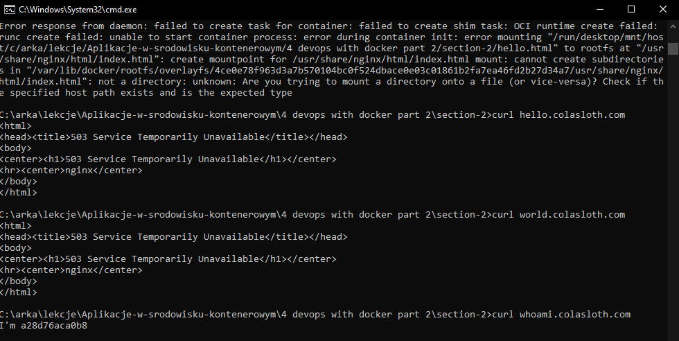

Sprawdzenie

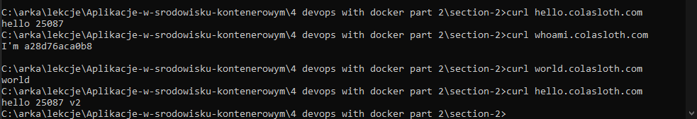

# 4.3 Wolumeny w praktyce

Polecenie:
```

docker compose up -d


```

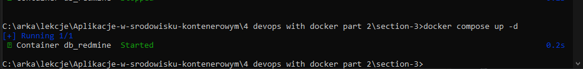


Polecenie:
```

docker container inspect db_redmine


```

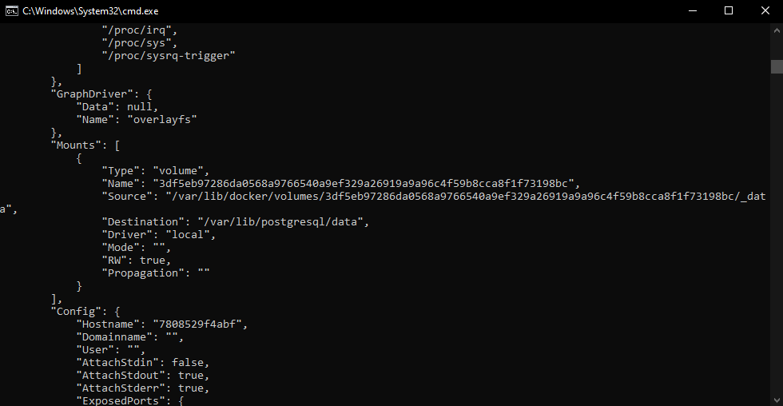

Polecenie:
```

docker compose down 

docker volume ls


```

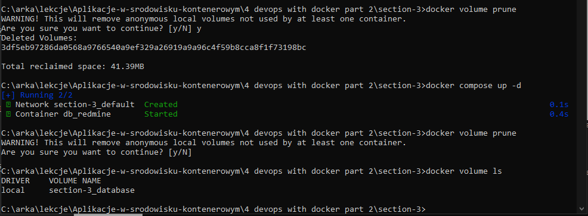


działający redmine

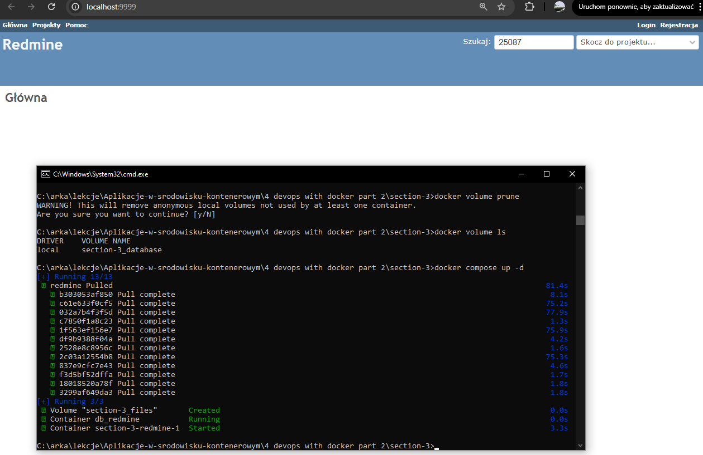

Polecenie 
```
docker container diff $(docker compose ps -q redmine)

```
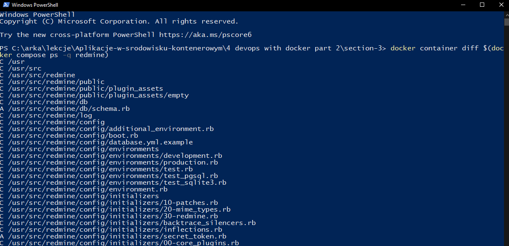

Adminer
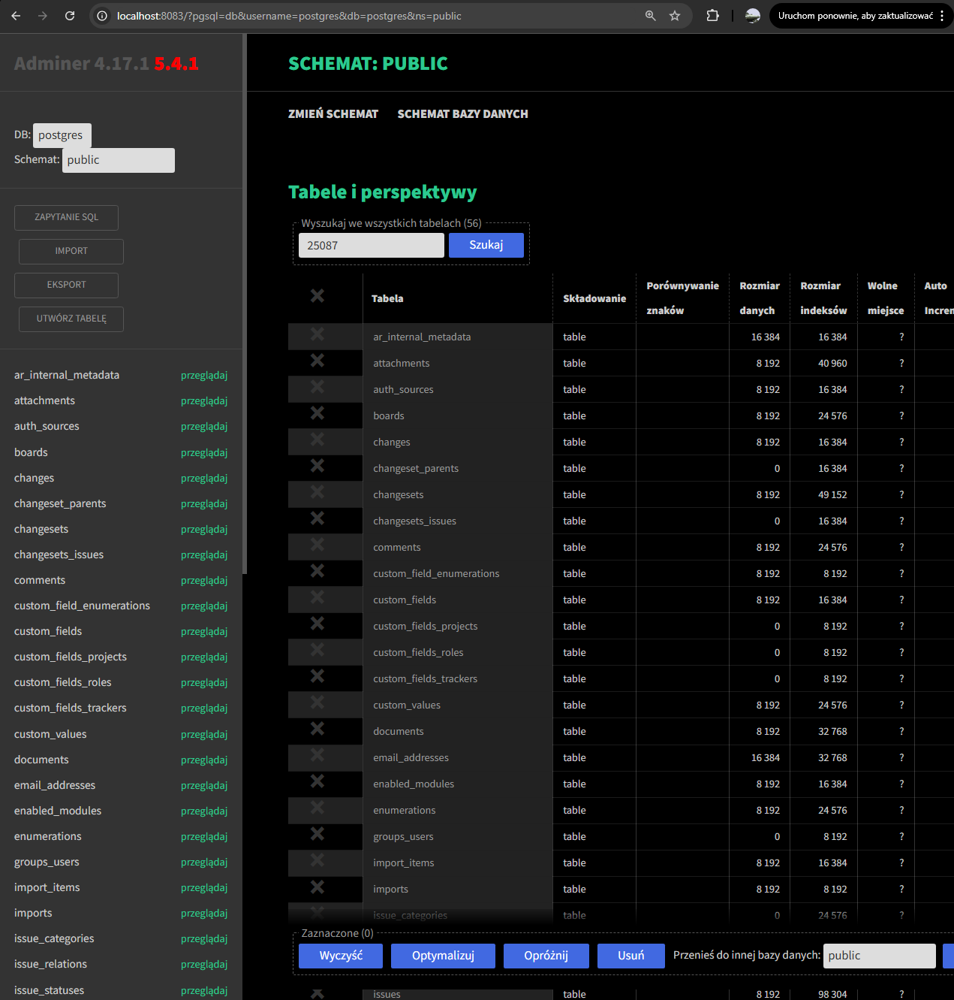

# 4.4 Kontenery w środowisku deweloperskim

Polecenie 
```
docker compose up -d

```
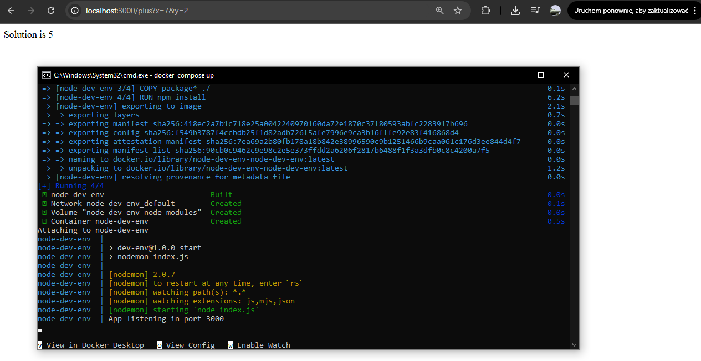

poprawiona wersja

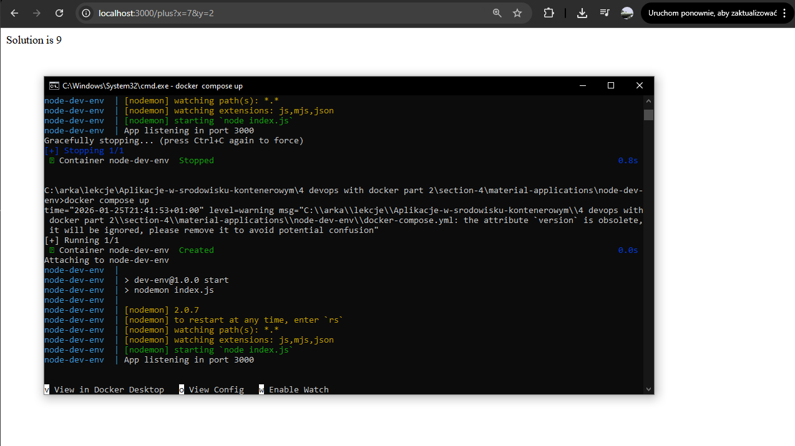