# 5 devops with docker part 3


Dodwanie tokenów


Dodany obraz do dockerhuba

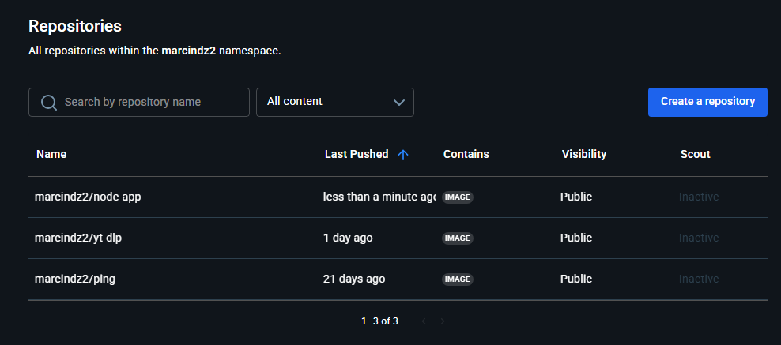

Uruchomiony serwer

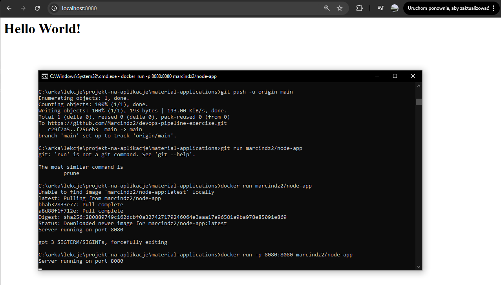

Strona po zaktualizowaniu 

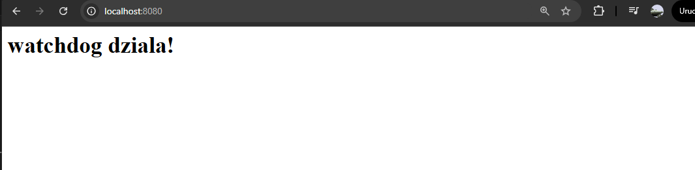

Uruchomienie skryptu

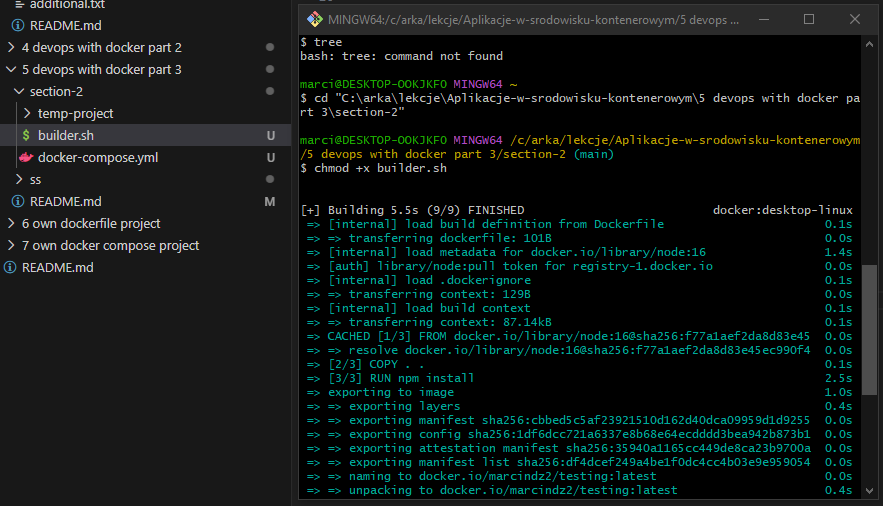

Wynik uruchomionego skryptu

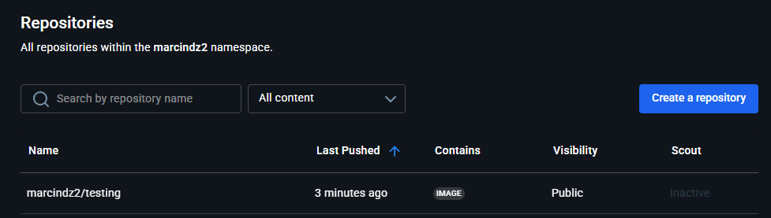

Skrypt uruchomiony w kontenerze 

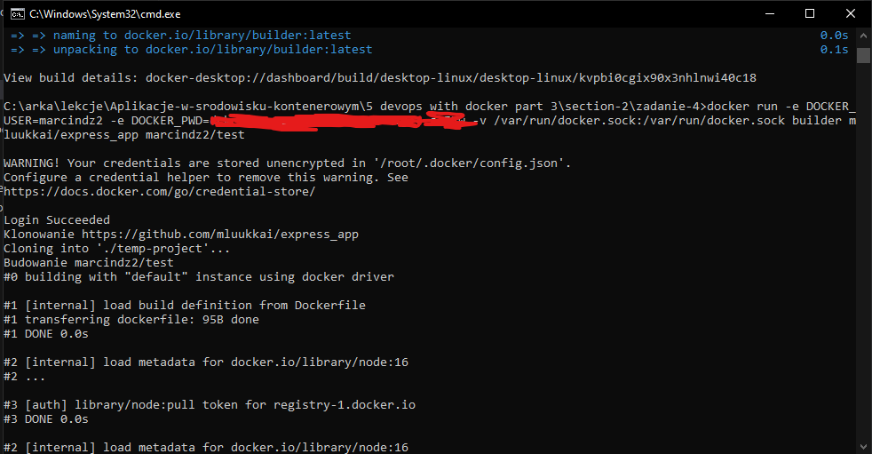

Wynik w dockerhubie

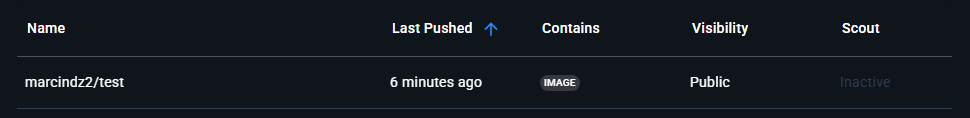


Uruchomienie yt-dlp bez zmiany wlasciciela folderu

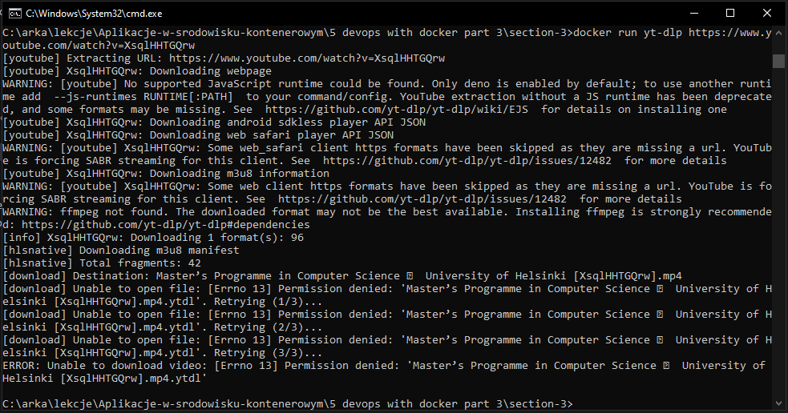

Uruchomienie po zmianie wlasciciela (wracamy do problemu z pobieraniem czyli wszystko gra)


Wielkosc starego yt-dlp

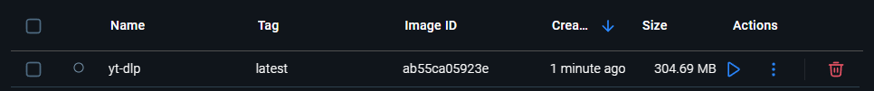

Wielkosc nowego yt-dlp

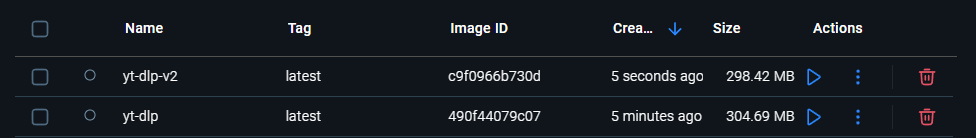

Sprawdzenie wielkosci poszczegolnych krokow dla yt-dlp

Polecenie:
```
docker image history yt-dlp
```

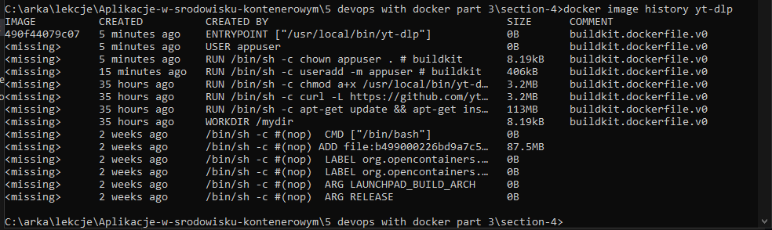

W przypadku kolejnego kroku optymalizacji widac znaczące zmniejszenie objętosci

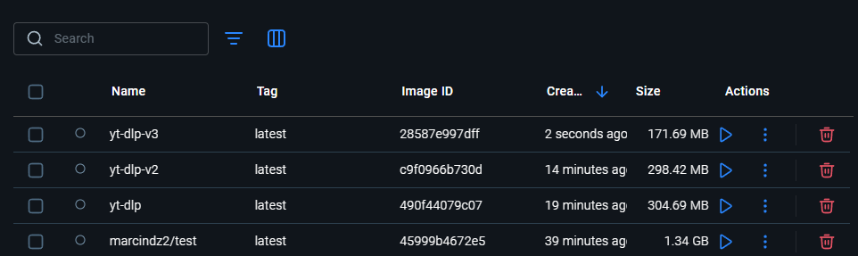

Przy ostatnim kroku udalo sie zmniejszyc poczatkowy rozmiar prawie 4 krotnie

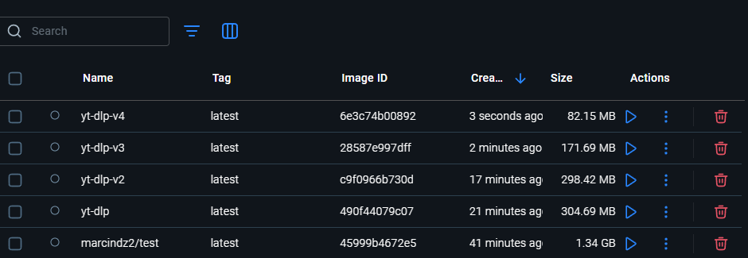

Co ciekawe w tym przypadku rozmiar z ubuntu nie rozni sie od rozmiaru z alpine

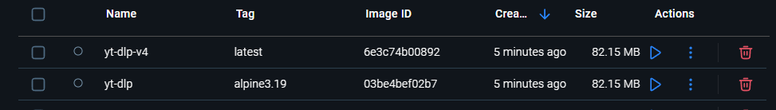

W odroznieniu od kursu w naszym przypadku powstaly obraz jest lzejszy niz poprzedni

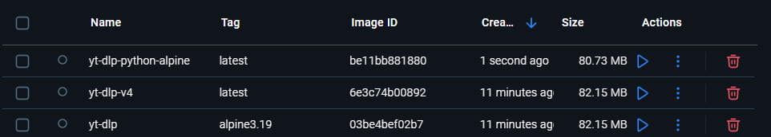

