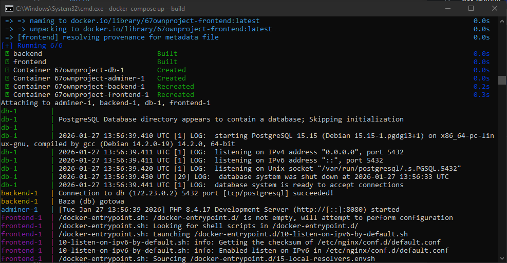
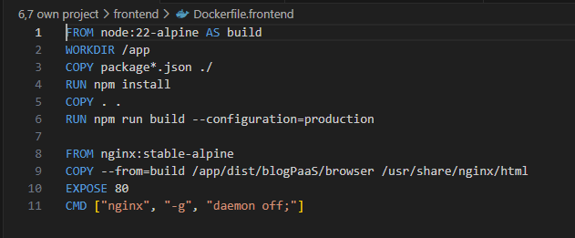
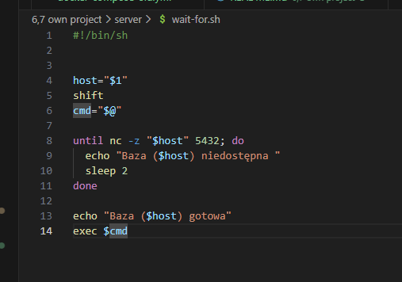
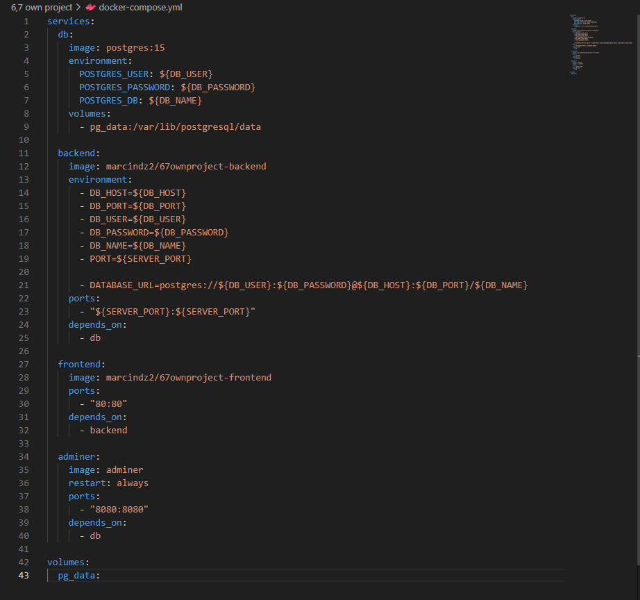

# 6,7 own docker project

W skład projektu wchodzą pliki dockerfile oddzielnie dla frontendu oraz backendu, plik .sh oraz docker-compose.yml

# Projekt

Projekt został oparty na aplikacji full-stack z blogiem. Frontend wykorzystuje angulara natomiast backend bazuje na node.js oraz express.js. Sama baza danych postawiona jest na PostgreSQL.

# dockerfile frontend

Do zbudowania obrazu wykorzystałem obraz z gotowym nodem tak jak w devops część 3. Później instalowane są biblioteki angulara oraz kopiowany jest kod aplikacji. Przy użyciu run npm run build tworzona jest gotowa wersja strony.

Następnie gdy mamy już gotową aplikacje możemy wykorzystać inny obraz zawierający nginx i przerzucic do niego zawartość zbudowanej wcześniej strony. Dodatkowo ustawiona jest inforamcja o tym, z którego portu będzie korzystać kontener.
Ostatni krok to uruchomienie strony.

# docker backend

Całość jest stworzona na alpine z zainstalowanym nodem. Następnie dodane jest narzędzie umożliwiające komunikacje między skryptem a bazą, tak aby upewnić się, czy już jest gotowa. Parametr --no-cache pozbywa się dodatkowo śmieci po instalacji aby obraz był lżejszy.

Kolejny etap to przerzucenie listy wykorzystywanych bibliotek i ich instalacja. Ponownie pomijamy dodatkowe biblioteki podczas instalacji a następnie pobieramy pozostałe pliki serwera.

Następnie przenosimy skrypt i zmieniamy dla niego uprawnienia. Później jest on uruchamiany a zaraz po nim uruchamiany jest sam serwer poprzez przekazanie komendy startowej do skryptu.

# skrypt

Skrypt pobiera najpierw nazwe hosta a następnie komende startowa dla node'a. Później przy użyciu pobranego polecenia nc sprawdza w pętli czy baza danych już jest gotowa. Następnie uruchamia serwer.

# docker-compose

Na samym początku pobieramy obraz dla postgresa oraz pobieramy zmienne środowiskowe z .env aby nie umieszczać haseł w kodzie (oraz zazwyczaj na githubie). Później dodajemy do utworzonego wolumenu dane do przechowania po zamknięciu kontenerów.

Kolejnymi krokami uruchamiamy backend oraz frontend (w przypadku backendu również wykorzystujemy zmienne środowiskowe). Frontend ma domyślnie wpisane porty, ale jest to skutek przeoczenia na etapie tworzenia (podobnie skrypt sprawdza wyłącznie domyślny port dla postgre a nie ustawiony). Depends_on ustala, że najpierw musimu uruchomić baze danych. Skrypt i tak poczeka, aż baza nie będzie działać, dlatego bez sensu byłaby odwrotna kolejność uruchomienia.

Później uruchamiana jest sam frontend oraz adminer, który został dodatkowo dodany aby móc obejrzeć zawartość bazy danych.

Dodatkowo tworzony jest wolumen

